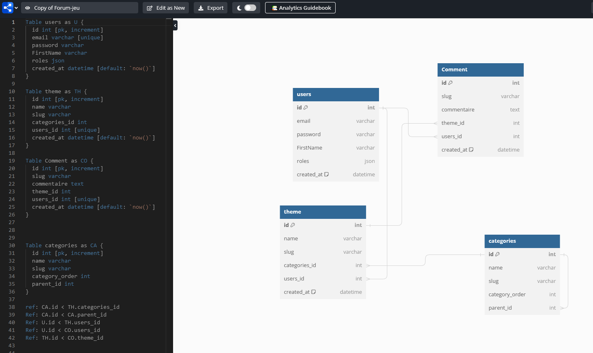

# User stories

| En tant que | Je veux | Afin de (si besoin/nécessaire) |
|--|--|--|
| Visiteur | Je veux pouvoir accéder à l'insciption  | pour me connecter sur le site | 
| Visiteur | Je veux pouvoir accéder à la connexion  | pour profiter pleinement des fonctionnalités du site | 
| Visiteur | Je veux pouvoir accéder à la liste des categories | afin de les consulter | 
| Visiteur | Je veux pouvoir accéder à la liste des thèmes | afin de les consulter et de pouvoir en créer |
| Visiteur | Je veux pouvoir accéder à la liste des commentaires |Afin de les consulter et de pouvoir en créer et de laisser un commentaire sur les thèmes de mon choix |
| Visiteur | Je veux pouvoir accéder à ma page de profil | Afin de modifier ou supprimer mes commentaires et d'accéder à certaines de mes informations de connexion et à l'activation de mon compte |

| En tant que | Je veux | Afin de (si besoin/nécessaire) |
|--|--|--|
| Administrateur | Je veux pouvoir accéder à l'insciption  | pour me connecter sur le site | 
| Administrateur | Je veux pouvoir accéder à la liste des thèmes | Afin de les consulter et de pouvoir en créer pour de  l'administration |
| Administrateur | Je veux pouvoir accéder à la liste des commentaires | Afin de les consulter et de pouvoir en créer et de laisser un commentaire sur les thèmes de mon choix pour de l'administration |
| Administrateur | Je veux pouvoir accéder à l'administration du site | pour gérer le fonctionnement du site et la modération des thèmes et des commentaires | 

 ## Détail de la base de données et de ces relations.

 ### Fonctionnement du site :

*Les catégories parentes ont des catégories enfant.*
*Les thèmes sont lié à une categorie enfant.*
*Les commentaires sont lié à un thème.*
*Les thèmes et commentaires sont lié à un utilisateur.*
